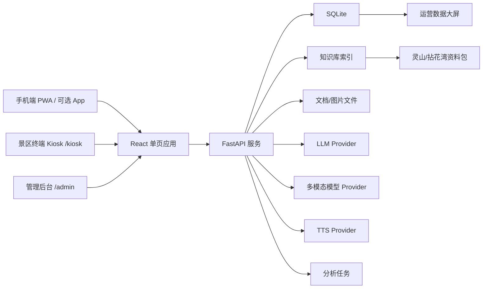

# A5 景区导览服务 AI 数字人国一冲刺方案

## 0. 赛题判断

赛题名称：景区导览服务 AI 数字人。

官网明确给出的核心要求：

- 开发游客交互端和管理后台。
- 支持语音、文本、表情等多模态交互。
- 数字人以语音、表情、口型同步方式回答。
- 支持智能问答、个性化路线推荐、游客感受度报告、数据大屏。
- 至少使用 1 个多模态大模型作为核心 AI 能力。
- 构建本地景区知识库，事实问答准确率不低于 90%。
- 语音问答延迟建议控制在 5 秒以内。
- 开发环境、语言、数据库、硬件不限；建议使用开源或可 API 调用的模型与语音方案。

当前团队假设：

- 1 名有开发经验的参赛者 + Codex 协作。
- 允许联网，演示环境优先假设可联网。
- 目标冒险冲击国一，因此要做完整闭环和可演示的创新点。

## 1. 产品定位

产品名暂定：灵境导游。

一句话定位：

面向灵山胜境与拈花湾的景区导览服务 AI 数字人，既能像导游一样讲解、问答、推荐路线，也能像运营中台一样分析游客关注点、情绪和服务缺口。

核心叙事：

传统导览是单向讲解，灵境导游是“可对话、可识景、可陪伴、可运营”的 AI 导游中台。

交互端定位：

- 手机 App/PWA：游客自己的手机使用，重点是轻量、定位/扫码、拍照识景、个性路线和游中陪伴。
- 景区终端 Kiosk：部署在游客中心、入口、热门景点旁的大屏触控设备，重点是大尺寸数字人、多人可看、快速问答、路线打印/扫码带走。
- 管理后台：景区管理方使用，重点是知识库维护、数字人配置、游客反馈分析和运营大屏。

开发策略：

同一套前端代码支持两种游客端形态：移动端响应式布局作为 PWA/App，可选后期用 Capacitor 打包；终端端使用 `/kiosk` 全屏路由，采用更大的按钮、更远距离可读字体、闲时欢迎页和扫码带走路线能力。

## 2. 国一打法

不要只做“LLM 聊天 + 数字人皮肤”。国一方案必须让评委看到：

- 技术完整：RAG、语音、数字人、拍照识景、后台分析都形成闭环。
- 产品可信：回答可溯源，低置信度会承认不知道并建议联系工作人员。
- 体验有记忆点：数字人会根据游客状态调整讲解语气和路线。
- 行业可落地：后台能看到知识缺口、热门问题、满意度趋势，不只是游客端玩具。

### 必打亮点

1. 可信知识库问答

基于本地资料包构建知识库，回答必须带来源景点卡片和置信度。对景点事实问题尽量使用检索内容，不允许模型自由编造开放时间、票价、历史数据。

2. 多模态识景导览

游客可上传或拍摄景点图片，系统识别景点后自动进入讲解。多模态模型可使用外部 API，降级方案是用预置景点图片或文字选择模拟。

3. 情绪感知数字人

数字人不只读答案，还根据意图和情绪切换状态：

- 欢迎态：游客进入系统。
- 思考态：检索和生成中。
- 讲解态：景点讲解。
- 安抚态：游客抱怨、迷路、时间紧张。
- 惊喜态：推荐必看演艺或隐藏打卡点。

4. 个性路线规划

根据兴趣、游玩时长、同行类型、体力偏好生成路线。路线不是普通列表，而是“点位顺序 + 每站讲解重点 + 表演时间提醒 + 预计停留”。

5. 管理端洞察闭环

后台展示：

- 服务人次、热门问题、低置信度问题。
- 游客兴趣标签和路线偏好。
- 情绪趋势、满意度趋势。
- 知识库缺口建议。
- 基于 14 万行行为数据的行业画像与消费/满意度分析。

### 国一必做与可砍线

国一目标要大胆，但交付不能赌命。按三层切线推进：

- A 档必做：手机 PWA、景区终端 Kiosk、管理后台概览、RAG 溯源问答、2D 数字人语音口型、路线推荐、图片识景最小闭环、准确率测试集。
- B 档增强：知识库在线编辑、数字人风格配置、情绪趋势、终端路线二维码带走、行为数据洞察文字生成。
- C 档可砍：Capacitor 原生 App 打包、英文/方言讲解、复杂 GPS、更多数字人服装、真实硬件终端适配。

如果时间吃紧，优先保证 A 档全通，再挑 B 档里最能出片的功能做精。

## 3. 技术路线

### 3.1 推荐栈

前端：

- React + Vite + TypeScript
- Zustand 或 TanStack Query
- ECharts
- PWA：用于手机 App 化安装和离线兜底。
- Kiosk Mode：独立 `/kiosk` 路由，适配触屏终端和横屏大屏。
- Web Speech API 作为浏览器端语音输入降级方案
- CSS Modules 或 Tailwind，选择一种即可

后端：

- FastAPI
- SQLite
- SQLAlchemy 或 SQLModel
- 本地文件存储上传文档和图片

AI 能力：

- LLM：OpenAI / 通义千问 / 豆包 / 智谱，做 provider 抽象。
- 多模态：使用支持图片理解的模型识别景点图片。
- Embedding：API embedding 或本地 bge-small-zh-v1.5。
- RAG：文档切片 + 向量检索 + rerank/规则重排 + 引用来源。
- ASR：先用浏览器 Web Speech API；增强可接 Whisper API 或 faster-whisper。
- TTS：先用浏览器 SpeechSynthesis 或 Edge TTS；增强可接 CosyVoice/ParaTTS。
- 数字人：Web 2D 数字人，音素/音量驱动口型，状态机驱动表情。

### 3.2 架构

### 3.3 RAG 数据流

1. 解析 docx/xlsx。
2. 将结构化景点数据转为景点卡片。
3. 将长文档按标题、段落和景点实体切片。
4. 生成 embedding 并入库。
5. 用户提问后进行：

- 查询改写：抽取景点、意图、时间、游客画像。
- 向量召回：取 top_k。
- 规则加权：景点名精确命中优先，演出时间问题优先查结构化字段。
- 生成回答：只基于检索内容回答。
- 引用输出：返回来源片段、景点卡片、置信度。

### 3.4 数字人方案

MVP 不做复杂 3D 建模，做稳定、漂亮、可控的 2D 数字人：

- Canvas/SVG/CSS 分层头像。
- 口型：闭口、微张、大张、微笑 4 到 6 个状态。
- 表情：normal、thinking、speaking、happy、concerned、guide。
- 动作：眨眼、轻微呼吸、讲解手势、欢迎挥手。
- 口型驱动：TTS 播放时用音频音量或定时音素模拟。

优势：

- 稳定可控，适合 1 人开发。
- 演示视频效果足够明确。
- 可以把精力放在 AI 和产品闭环上。

### 3.5 图片识景方案

主路径：

- 游客上传图片。
- 多模态模型识别图片最可能对应的景点。
- 后端将识别结果映射到景点 ID。
- 自动生成“这是哪里 + 看点 + 下一步推荐问题”。

降级路径：

- 如果模型不可用，使用用户选择景点或预置样例图继续演示。
- 后端保留 provider status，演示时能显示当前使用在线识别或降级识别。

### 3.6 后台分析方案

后台数据来源分两类：

1. 系统交互日志

- user_id/session_id
- query
- answer
- intent
- attraction_id
- confidence
- sentiment
- satisfaction
- latency_ms
- created_at

2. 公开游客行为数据

字段包括 age、gender、attraction_type、visit_date、stay_duration、ticket_cost、food_cost、shopping_cost、transport_cost、entertainment_cost、total_cost、group_size、satisfaction。

用途：

- 生成行业游客画像。
- 展示满意度与停留时长、消费、人群类型的关系。
- 为路线推荐提供“偏好先验”，但不要声称这是灵山真实游客数据。

### 3.7 质量评测与兜底

必须把评测系统作为功能的一部分，而不是最后写几道题糊上去。

问答评测：

- 建 `evals/qa_lingshan.jsonl`，每条包含 question、expected_keywords、source_file、source_attraction、must_not_include。
- 至少 50 题，覆盖事实、历史、演艺时间、路线推荐、未知问题和诱导编造。
- 跑 `/api/chat` 后生成命中率、引用命中率、低置信度兜底率、平均延迟。

多模态评测：

- 准备 8 到 10 张演示样例图，可来自公开图片或自己整理的样例。
- 记录 expected_attraction_id、recognized_attraction_id、confidence、fallback_used。
- 成功率低于 80% 时，演示切到“识别 + 手动确认”模式，不能让流程断掉。

模型兜底：

- 每个 provider 都要有 mock provider。
- 无 API key 时系统仍能用预置答案、预置路线和样例识景完成演示。
- 后台显示当前 provider 状态，避免评委现场问“断网怎么办”时没有答案。

## 4. 项目边界

### 做

- 手机游客端：Web/PWA 优先，可选 Capacitor 打包为 App。
- 景区终端端：Web Kiosk 全屏触控模式。
- Web 管理后台。
- 本地知识库和 RAG。
- 语音输入/输出。
- 2D 数字人表情与口型同步。
- 图片识景。
- 个性路线推荐。
- 交互日志分析和数据大屏。
- 准确率/识景率/延迟评测脚本。
- 部署文档、设计文档、PPT 和演示视频脚本。

### 不做

- 首版不分别开发原生 iOS、原生 Android 和独立桌面客户端。
- 真实支付、购票、订单、客服工单。
- 真实高精度 GPS 室内定位。
- 自训练大模型。
- 生产级 3D 数字人。
- 多景区商业 SaaS 的完整租户体系。

### 可选加分

- 二维码点位定位：游客扫景点二维码模拟当前位置。
- 弱网/无网降级：预置 FAQ 与路线模板。
- 方言/英文讲解：演示一两个样例即可。
- 管理员一键生成知识库改进建议。

## 5. 里程碑

### M0：项目骨架

目标：前后端能跑，资料能解析。

- 建 Vite React 前端。
- 建移动端 `/` 和终端端 `/kiosk` 两个游客入口。
- 建 FastAPI 后端。
- 建 SQLite schema。
- 解析 docx/xlsx 到 JSON。
- 提供 `/health`、`/attractions` API。

### M1：可信问答闭环

目标：完成核心评分项的底座。

- 建知识切片。
- 接入 embedding 和 LLM provider。
- 实现 `/chat`。
- 返回答案、来源、置信度、延迟。
- 前端完成聊天界面和景点卡片。

### M1.5：多模态最小闭环

目标：尽早满足“至少 1 个多模态大模型”的硬要求，降低后期风险。

- 建 VLM provider 接口和 mock provider。
- 实现 `/recognize` 图片上传接口。
- 支持 3 到 5 个样例图识别到景点。
- 识别后能自动触发景点讲解。

### M2：数字人交互

目标：贴合赛题“AI 数字人”。

- 游客端数字人组件。
- TTS 播放。
- 口型和表情状态机。
- 文本/语音输入。
- 演示问答流程顺畅。

### M3：路线与多模态

目标：形成国一亮点。

- 个性化路线推荐。
- 图片识景从最小闭环打磨到 8 到 10 个稳定样例。
- 路线地图/节点视图。
- Kiosk 端路线二维码带走。

### M4：管理后台

目标：功能完整度拉满。

- 知识库管理。
- 数字人配置。
- 游客反馈分析。
- 热门问题、情绪趋势、满意度趋势。
- 行业行为数据大屏。

### M5：打磨与交付

目标：从作品变成比赛作品。

- 准确率测试集。
- 延迟和稳定性兜底。
- 初赛部署手册。
- 总体设计文档。
- 方案介绍 PPT。
- 7 分钟演示视频脚本。

## 6. 验收指标

技术指标：

- 事实问答准确率：自建测试集达到 90% 以上。
- 常规文本问答首包或完整响应：目标 5 秒内。
- 页面核心流程无崩溃。
- 图片识景演示样例成功率：10 个样例中至少 8 个正确。

产品指标：

- 游客端 5 分钟内能完成：进入、语音提问、听讲解、识景、生成路线、提交反馈。
- 后台 3 分钟内能展示：知识库、日志、洞察、大屏。
- 演示视频 7 分钟内能讲清楚痛点、方案、技术、效果和亮点。

## 7. 最大风险与预案

1. 数字人太复杂导致延期

预案：坚持 2D 数字人，表情和口型可控优先。

2. 外部模型不稳定

预案：provider 抽象 + 本地 mock + 预置演示样例。

3. RAG 准确率不够

预案：结构化景点卡优先；演出时间、参数、位置类问题直接查字段；长文档只做补充。

4. 一个人做不完

预案：先打穿游客端核心闭环，再补后台。后台图表可以从真实日志和公开 xlsx 生成，复杂 CRUD 降级为只读配置。

5. 演示平淡

预案：提前设计视频故事线：游客入园、拍照识别九龙灌浴、问演出时间、路线推荐、抱怨时间不够、数字人改短路线、后台发现热门问题和知识缺口。

6. 范围失控

预案：严格按 A/B/C 档切线。每个里程碑都要有一个可演示版本，不允许等所有模块都做完才集成。

7. 终端端涉及个人隐私

预案：Kiosk 默认匿名会话，超时自动清空；不展示游客历史记录；路线用短期分享码，过期失效。

## 8. 评审补强结论

### CEO 视角

方向成立。国一打法不应该再加更多“炫技模块”，而应该把两个游客端联动做成记忆点：景区终端生成路线，手机扫码带走，游中继续由数字人陪伴。这个链路同时解释了“手机 App 或景区终端设备”的真实落地场景。

最重要的产品判断：

- 保持双端 + 后台，不扩成多景区 SaaS。
- 把多模态识景提前到 M1.5，不做最后冲刺项。
- 把评测面板做成作品可信度的一部分，而不是开发者自测工具。

### Design 视角

当前 PRD 已补充 UI/UX 设计系统。实现时要避免两种常见失败：

- 游客端做成聊天软件，数字人只是摆设。
- 后台做成花哨大屏，缺少可读的数据表和知识缺口。

设计基准：

- 手机端是游中陪伴工具。
- Kiosk 是 1 到 2 米外可读的大屏触控设备。
- 管理后台是高密度运营工具，不是景区宣传站。

### Engineering 视角

架构选择合理，但必须坚持 provider 抽象和 mock 模式。没有 mock provider，这个项目在演示现场会很脆。

关键工程要求：

- LLM、Embedding、VLM、TTS 都走后端 provider。
- API Key 不进入前端。
- 资料解析、RAG、识景、路线、Kiosk 会话、评测都有测试或 smoke test。
- Kiosk 不持久化私人状态，share_code 短期过期。

### DX 视角

开发者体验原计划偏弱，已经在 PRD 中补上：

- `.env.example`
- mock provider
- 资料导入命令
- 本地 demo 命令
- eval 命令
- 统一错误格式

目标是 5 分钟内跑通本地 demo。

### UI/UX Pro Max 检查

已按 `ui-ux-pro-max` 的关键规则补充：

- 触控目标：手机 44px 以上，Kiosk 64px 以上。
- 响应式断点：375、768、1024、1440、1920。
- 可访问性：对比度、focus、reduced-motion、空状态。
- 图表：标题、单位、时间范围、空状态。
- 图标：统一 SVG 图标，不用 emoji 做结构图标。

## 9. NOT in scope

| 项 | 暂不做原因 |
|----|------------|
| 原生 iOS/Android 双端 | Web/PWA 可覆盖比赛演示，原生会拖慢核心功能 |
| 真实售票/支付/订单 | 不在赛题核心，容易引入业务噪音 |
| 真实室内高精度定位 | 硬件和场地不可控，用二维码点位模拟更稳 |
| 生产级 3D 数字人 | 一个人开发风险过高，2D 数字人更可控 |
| 多景区租户 SaaS | 初赛重点是示范景区闭环，不是商业平台化 |
| 完整离线大模型 | 可以有 mock/FAQ 降级，不训练或部署大模型 |

## 10. What already exists

| 已有资料 | 用途 |
|----------|------|
| `示范景区公开资料包/灵山胜境 景点结构化数据集.docx` | 景点卡片、结构化问答、路线站点 |
| `示范景区公开资料包/灵山胜境：历史、文化、景点特色与个性化游览指南.docx` | RAG 长文档、文化讲解、路线模板 |
| `示范景区公开资料包/景点景区旅游数据行为分析数据.xlsx` | 行业画像、后台行为分析样例 |
| `SOFTBEI_A5_PLAN.md` | 战略、架构、里程碑、风险 |
| `SOFTBEI_A5_PRD.md` | PRD、API、数据模型、任务切片 |

## 11. GSTACK REVIEW REPORT

| Review | Trigger | Status | Findings |
|--------|---------|--------|----------|
| CEO Review | `autoplan / plan-ceo-review` | CLEAR | 方向成立，重点从“功能堆叠”收敛为“双端联动 + 可信导览 + 后台洞察” |
| Design Review | `plan-design-review + ui-ux-pro-max` | CLEAR WITH NOTES | 已补 UI/UX 设计系统、三端布局、触控尺寸、可访问性和图表规则 |
| Eng Review | `plan-eng-review` | CLEAR WITH NOTES | 已补 provider 抽象、mock 模式、测试矩阵、失败模式和并行开发策略 |
| DX Review | `plan-devex-review` | CLEAR WITH NOTES | 已补 `.env.example`、mock demo、资料导入、eval、统一错误格式 |

**UNRESOLVED:** 1 个品味选择，数字人视觉风格还需要在实现前确定是“禅意写实 2D”还是“轻拟物卡通 2D”。

**VERDICT:** 可以进入 Task 01。先做项目骨架、资料解析、三端布局壳和 mock provider。

## 12. 评审决策记录

本次评审读取了用户授权的 gstack review 技能与 `ui-ux-pro-max` 技能说明。`ui-ux-pro-max` 的搜索脚本在当前安装中是外部相对路径占位，未继续越界读取其真实脚本目录。

| # | 发现 | 决策 | 理由 |
|---|------|------|------|
| 1 | 手机端和景区终端端原先只是口头提到 | 明确双端形态和 `/kiosk` 路由 | 赛题原话要求手机 App 或景区终端设备，双端能增强落地感 |
| 2 | 多模态识景排期偏后 | 增加 M1.5 多模态最小闭环 | 多模态大模型是硬要求，不能拖到后期冒险 |
| 3 | 国一方案范围大 | 增加 A/B/C 可砍线 | 一个人开发必须知道先保什么、砍什么 |
| 4 | 缺少评测闭环 | 增加问答、识景、延迟评测要求 | 90% 准确率是评分点，需要可证明 |
| 5 | Kiosk 隐私和会话清理未写清 | 增加匿名会话、超时清空、短期分享码 | 终端设备是公共场景，隐私是评委会问的问题 |
| 6 | 缺少 UI 设计系统 | 在 PRD 新增三端设计系统 | Codex 后续实现需要明确布局、触控、图表和可访问性规则 |
| 7 | 缺少 DX 入口 | 在 PRD 新增开发者体验要求 | 5 分钟本地 demo 是后续高效 vibe coding 的基础 |
| 8 | 缺少工程失败模式 | 在 PRD 新增测试矩阵和失败模式 | 赛题演示最怕外部模型、语音、识景任一环节现场掉链子 |
