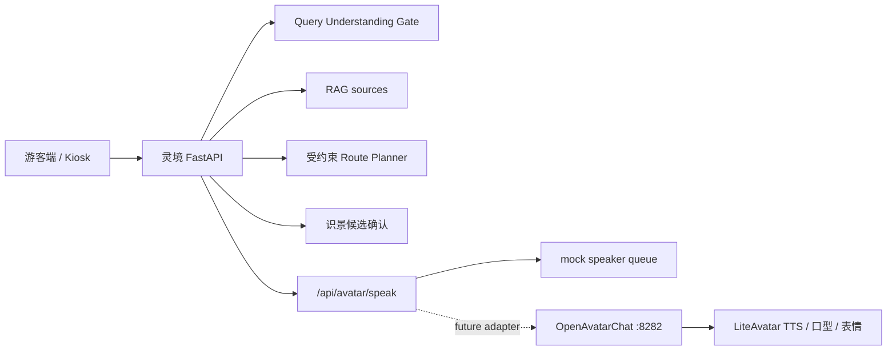

# Avatar Text Speaker Sidecar 方案

## 结论

OpenAvatarChat + LiteAvatar 继续作为 `灵境导游` 的数字人表现层 sidecar 预研，不接管业务大脑。当前推荐从“官方全链路 ASR + LLM + TTS + Avatar”改为“灵境后端文本驱动播报”：

```text
灵境 FastAPI / RAG / Route / Vision
-> 已生成、已溯源、已受约束的短文本
-> POST /api/avatar/speak
-> Avatar Text Speaker Adapter
-> mock 队列 / 未来 sidecar TTS+口型+表情
```

这样做的原因：

- 官方全链路会叠加 ASR、LLM、TTS、avatar 推理，响应链路更长，现场稳定性更难控。
- 景区事实、路线点位、识景结论已经由灵境后端控制，sidecar 不应再次调用 LLM 决定答案。
- 无 API Key 时主流程必须可运行，mock 队列能保证游客端、Kiosk、Admin 和分享页不受 sidecar 影响。
- 后续如果 OpenAvatarChat 文本注入适配稳定，只需要替换 adapter，不改变 RAG、路线、识景和运营分析。

## 当前调研结论

### 灵境现有数字人触发点

当前主项目已有稳定的前端数字人层：

- `frontend/src/components/DigitalHumanMock.tsx`
- `frontend/src/hooks/useDigitalHumanState.ts`
- `frontend/src/hooks/useSpeechSynthesis.ts`
- `frontend/src/hooks/useSpeechRecognition.ts`
- `frontend/src/pages/MobileHomePage.tsx`
- `frontend/src/pages/KioskPage.tsx`

现有能力：

- 状态机：`welcome`、`listening`、`thinking`、`speaking`、`comforting`、`error`、`happy`。
- 浏览器 `SpeechSynthesis` 播报。
- 可选 `SpeechRecognition` 输入降级。
- QA、识景、路线、澄清、反馈等流程已经会切换数字人状态并触发短文本播报。

因此 sidecar 只需要增强“表现层”，不需要重写游客问答、识景或路线逻辑。

### OpenAvatarChat / LiteAvatar 现状

本机预研已经验证：

- WebUI 入口：`http://127.0.0.1:8282/ui/index.html`
- `/liveness` 可用。
- `/readiness` 可用。
- LiteAvatar worker 可 ready。

从当前 `external/OpenAvatarChat` 代码看，WebUI 主要通过 WebRTC 和 data channel 交互：

- `/openavatarchat/initconfig` 返回前端初始化配置。
- `/webrtc/offer` 建立 WebRTC 会话。
- WebUI 的 `sendText()` 会在 WebRTC data channel 已建立后发送 `SendHumanText` 消息。

当前没有在主项目中确认一个可直接复用的“HTTP POST 文本 -> TTS/口型播放”的稳定接口。因此本轮不把 OpenAvatarChat 接入主流程，只定义灵境后端契约和 mock 队列。

## 最小接口契约

后端对前端：

```http
POST /api/avatar/speak
Content-Type: application/json
```

Request:

```json
{
  "text": "为您规划好了礼佛文化路线，全程约 45 分钟。",
  "emotion": "happy",
  "source": "route",
  "interrupt": true
}
```

Response:

```json
{
  "mode": "mock",
  "accepted": true,
  "message": "已进入数字人播报队列",
  "fallback_reason": null,
  "metadata": {
    "requested_mode": "mock",
    "emotion": "happy",
    "source": "route",
    "interrupt": true,
    "text_chars": 24,
    "latency_ms": 0,
    "policy": "trusted_backend_text_only"
  }
}
```

字段约束：

- `text`：必填，去除多余空白后必须为 1 到 300 字。
- `emotion`：`welcome`、`thinking`、`speaking`、`comforting`、`error`、`happy`、`neutral`。
- `source`：`qa`、`route`、`vision`、`clarification`、`feedback`、`kiosk`、`share`、`system`。
- `interrupt`：是否打断上一段播报，默认 `true`。

错误格式沿用项目统一结构：

```json
{
  "code": "AVATAR_SPEAK_TEXT_TOO_LONG",
  "message": "数字人播报文本过长，请先生成更短的讲解摘要。",
  "cause": "Avatar speak text length is 420, limit is 300.",
  "fix": "只传入 QA、路线、识景等灵境后端产出的 300 字以内可信摘要。"
}
```

## 配置

`.env.example` 只提供空占位，不包含真实 Key：

```env
AVATAR_SPEAKER_MODE=mock
AVATAR_SIDECAR_BASE_URL=
AVATAR_SIDECAR_ADAPTER=readiness
AVATAR_SIDECAR_SPEAK_PATH=
AVATAR_SPEAKER_TIMEOUT_SECONDS=3
```

模式说明：

- `AVATAR_SPEAKER_MODE=mock`：默认模式，直接返回 `accepted=true`，不依赖 OpenAvatarChat 或任何模型厂商。
- `AVATAR_SPEAKER_MODE=sidecar`：sidecar 适配模式。当前不会使用 OpenAvatarChat 的 `SendHumanText` 作为可信播报入口；只有配置了显式本地 bridge 时才会尝试注入。
- `AVATAR_SIDECAR_BASE_URL`：未来指向 `http://127.0.0.1:8282`。
- `AVATAR_SIDECAR_ADAPTER=readiness`：默认只检查 `/readiness` 并降级 mock，适合预研和演示兜底。
- `AVATAR_SIDECAR_ADAPTER=http_json`：调用 `AVATAR_SIDECAR_SPEAK_PATH` 指向的本地 bridge HTTP JSON 端点。该 bridge 必须只播报灵境后端文本，不调用 LLM 生成答案。
- `AVATAR_SIDECAR_SPEAK_PATH`：bridge 的相对路径或完整 URL，例如 `/lingjing/avatar/speak`；当前 OpenAvatarChat 0.6.x 官方服务没有这个端点。
- `AVATAR_SPEAKER_TIMEOUT_SECONDS`：sidecar readiness 检查超时，默认 3 秒。

## 数据流



前端只能调用 `灵境 FastAPI`。即使后续启用 sidecar，前端也不直接调用 OpenAvatarChat 或模型厂商。

## 降级策略

1. mock 模式：直接接受播报请求，游客端继续使用当前 React/SVG/CSS 数字人和浏览器 TTS。
2. sidecar base URL 为空：返回 `accepted=true`，`fallback_reason` 说明未配置 sidecar。
3. sidecar readiness 超时或失败：返回 `accepted=true`，降级 mock，不影响 QA、路线、识景和分享流程。
4. sidecar ready 但未配置本地 bridge：返回 `accepted=true`，降级 mock，避免假装已经进入 OpenAvatarChat 播放队列。
5. bridge 注入失败、超时或返回 `accepted=false`：接口不抛 500，返回 `accepted=true` 并说明 `fallback_reason`，主流程继续 mock 播报。

主流程永远不能因为 sidecar 不可用而失败。

## 业务边界

Sidecar 不允许：

- 回答景区事实。
- 自由规划路线点位。
- 绕过 Query Understanding Gate。
- 绕过 RAG sources。
- 绕过 `ROUTE_CONSTRAINT_RULES`。
- 读取或保存游客身份。
- 直连模型厂商生成答案。
- 声称接入 GPS 导航、地图导航服务、现场客流硬件或实时定位。

Sidecar 只允许：

- 播报灵境后端已经生成的可信短文本。
- 根据 `emotion` 切换表现层状态。
- 根据 TTS 音频驱动口型和表情。
- 在不可用时安静降级到 mock 数字人。

## 后续实施阶段

### Phase 1：当前已落地

- 新增 `/api/avatar/speak` mock 契约。
- 新增空配置占位。
- 新增本文档。
- 不接入 OpenAvatarChat 主流程。

### Phase 2：Sidecar adapter spike

目标是在 ignored 实验目录内验证“可信文本注入”。2026-05-15 的协议调查结论：

- 当前 LiteAvatar probe 配置使用 `RtcClient`，WebUI 通过 `/webrtc/offer` 建立 WebRTC session。
- WebUI 的文本按钮会在已建立的 `RTCDataChannel('text')` 上发送 `SendHumanText`。
- `SendHumanText` 在 OpenAvatarChat 里被写入 `EngineChannelType.TEXT`，类型是 `HUMAN_TEXT`，后续会进入当前配置的 LLM/TTS/avatar 链路。
- 因此，`SendHumanText` 是“用户输入”协议，不是“数字人直接播报这段后端可信文本”的稳定接口。
- 当前官方服务没有发现可直接 `HTTP POST 文本 -> TTS/口型/数字人播报` 的本地 endpoint。

当前最小实现：

- `AVATAR_SIDECAR_ADAPTER=readiness`：只确认 sidecar 存活，仍降级 mock。
- `AVATAR_SIDECAR_ADAPTER=http_json`：预留给本地 bridge endpoint。bridge 成功时 `/api/avatar/speak` 返回 `mode="sidecar"`；bridge 不存在或失败时降级 mock。
- 新增 `scripts/avatar_sidecar_protocol_probe.py`，用于检查 `/liveness`、`/readiness`、`/openavatarchat/initconfig` 并输出当前注入面判断；该脚本不会发送文本。

后续可选方案：

- 方案 A：在 OpenAvatarChat 内新增专用 handler，把外部文本视为 avatar 要播报的文本，不调用 LLM。
- 方案 B：在 sidecar 外层加一个独立 bridge 服务，负责把 `/api/avatar/speak` 队列转换为 OpenAvatarChat WebRTC/data channel 消息。
- 方案 C：保留 OpenAvatarChat WebUI 只做视觉预览，主流程继续用浏览器 TTS。

当前不采用方案 B 直接向 WebUI `SendHumanText` 发送消息，因为这会把灵境后端已经生成的可信回答重新作为“用户问题”交给 OpenAvatarChat LLM，违反 sidecar 只做表现层的边界。

进入 Phase 2 前必须确认：

- 不提交 external/OpenAvatarChat 第三方源码、模型、日志或 Key。
- 不要求 API Key 才能跑主项目。
- 不改变 RAG、Route Planner、Vision、Analytics 的业务决策逻辑。

### Phase 3：前端 feature flag

只有当 Phase 2 证明 sidecar 可稳定文本播报后，再考虑：

- `VITE_AVATAR_SIDECAR_ENABLED=false`
- `VITE_AVATAR_SIDECAR_URL=`
- 新增 `AvatarStage`，内部在 sidecar 可用时展示 sidecar，否则展示当前 `DigitalHumanMock`。

## 风险

| 风险 | 影响 | 处理 |
| --- | --- | --- |
| OpenAvatarChat 没有稳定 HTTP 文本播报接口 | 不能直接接入 `/api/avatar/speak` | 先保留 mock 契约，后续做 adapter spike |
| WebRTC / 麦克风 / HTTPS 权限不稳定 | 演示现场失败 | sidecar 不进入主线，mock 数字人兜底 |
| TTS 依赖模型厂商 Key | 无 Key 时不可用 | 主流程使用 mock/浏览器 TTS，Key 只作为可选增强 |
| sidecar 自带 LLM 绕过业务 | 可信边界被破坏 | 禁止 sidecar 生成事实或路线，只播报后端文本 |
| 延迟过高 | 数字人反应慢 | 灵境后端先生成短文本，sidecar 只做表现层 |

## 验收口径

- 无 API Key 时，`POST /api/avatar/speak` 返回 `accepted=true`。
- Sidecar 不可用时，QA、路线、识景、Kiosk、Admin、分享页不受影响。
- 文档和接口都明确：OpenAvatarChat + LiteAvatar 是表现层 sidecar，不是业务大脑。
- 后续接入 LLM 只能增强结构化理解或表达润色，不能绕过 RAG sources 和受约束 Route Planner。

## 2026-05-16 D2 status: LiteAvatar trusted text lip-sync spike

The preferred future adapter remains an OpenAvatarChat in-process `AVATAR_TEXT` endpoint, not WebUI `SendHumanText`.

Current D2 spike status:

- Ignored patch location: `external/OpenAvatarChat/src/handlers/client/rtc_client/client_handler_rtc.py`.
- Added endpoint shape: `POST /lingjing/avatar/speak`.
- Intended route: trusted Lingjing backend text -> `ChatDataType.AVATAR_TEXT` -> TTS -> LiteAvatar audio/video -> WebRTC.
- LLM boundary: bypassed by design; no `HUMAN_TEXT` submission.
- Verification status: not yet proven on the WebUI because patched OpenAvatarChat cannot restart past LiteAvatar worker `PermissionError: [WinError 5]`.

Until that worker startup issue is solved, the main product should keep the current React/SVG/CSS mock avatar fallback and use `/api/avatar/speak` only through mock or the local trusted bridge smoke path.

## 2026-05-16 D3 status: programmatic LiteAvatar trusted speak verified

D3 unblocked the patched sidecar startup by replacing the official dialogue config with an ignored pure presentation config:

```text
external/OpenAvatarChat/config/lingjing_trusted_liteavatar_edge_tts.yaml
```

That config avoids loading OpenAvatarChat LLM/ASR/VAD and keeps only `RtcClient`, `InterruptHandler`, `Edge_TTS`, and `LiteAvatar`. Trusted backend text is submitted as `AVATAR_TEXT`, then converted to `AVATAR_AUDIO` and `AVATAR_VIDEO` by TTS + LiteAvatar.

Programmatic verification through local `aiortc` WebRTC showed:

- active session visible from `/lingjing/avatar/sessions`
- main backend `/api/avatar/speak` returned `mode=sidecar`
- received remote audio/video frames after the trusted text request
- OAC logs showed `AVATAR_TEXT`, `AVATAR_AUDIO`, and `AVATAR_VIDEO`, with no `HUMAN_TEXT` or LLM branch for this request

This is still a sidecar spike. The default product path remains mock-first, and sidecar timeout/offline behavior must continue to degrade to mock without affecting RAG, Route Planner, Vision, Analytics, visitor UI, Kiosk, or Admin.
