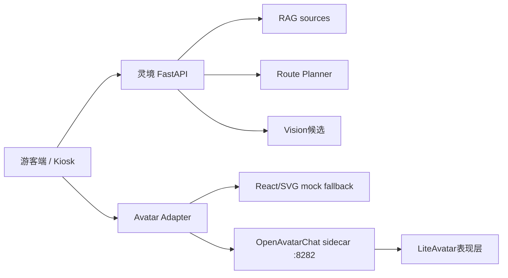

# OpenAvatarChat + LiteAvatar Sidecar 预研

## 结论

OpenAvatarChat + LiteAvatar 可以作为 `灵境导游` 的数字人表现层 sidecar 继续预研，但当前不建议直接替换主线 mock 数字人。

推荐路线是：

1. 保留当前 React/SVG/CSS mock 数字人作为默认和比赛兜底。
2. 将 OpenAvatarChat 单独部署在 sidecar 端口，例如 `127.0.0.1:8282`。
3. 游客端只在 feature flag 开启且 sidecar health 正常时嵌入 sidecar 画面。
4. 业务大脑仍由当前 FastAPI 负责：Query Understanding、RAG、Route Planner、Vision、Analytics。
5. OpenAvatarChat 不直接回答景区事实、不自由规划路线、不读取真实 API key 到前端。

这条路线能把风险压到表现层。如果 sidecar 失败，主线问答、识景、路线、Kiosk 和后台不受影响。

## 官方资料摘要

调研来源：

- OpenAvatarChat GitHub README: https://github.com/HumanAIGC-Engineering/OpenAvatarChat
- OpenAvatarChat 快速开始: https://humanaigc-engineering.github.io/OpenAvatarChat/getting-started/
- LiteAvatar 快速上手: https://humanaigc-engineering.github.io/OpenAvatarChat/getting-started/liteavatar.html
- OpenAvatarChat WebUI README: https://github.com/HumanAIGC-Engineering/OpenAvatarChat-WebUI
- LiteAvatar README: https://github.com/HumanAIGC/lite-avatar

关键事实：

- OpenAvatarChat 是模块化交互数字人对话实现，支持文本、语音、视频等交互，并可替换 ASR、LLM、TTS、Avatar 组件。
- 0.6.0 版本已拆出前后端，官方 WebUI 是 Vue 3 + TypeScript + Vite，后端默认将前端挂载到 `/ui`。
- 官方配置默认服务端口是 `8282`，启动命令形态为 `uv run src/demo.py --config <config>.yaml`。
- LiteAvatar 快速上手使用 `config/chat_with_openai_compatible_bailian_cosyvoice.yaml`，handler 组合包含 RTC、Silero VAD、SenseVoice、OpenAI-compatible LLM、百炼 CosyVoice TTS 和 LiteAvatar。
- LiteAvatar 快速上手提示需要 `DASHSCOPE_API_KEY`，或项目根目录 `.env`。
- OpenAvatarChat 快速开始要求 git-lfs、git submodule，并要求本机 NVIDIA 驱动支持 CUDA 版本 `>= 12.8`。
- LiteAvatar 独立仓库 README 描述它是实时 2D audio2face avatar，可在 CPU 设备上运行，并推荐 Python 3.10 与 CUDA 11.8；但 OpenAvatarChat 0.6.x 的整体运行要求以 OpenAvatarChat 文档为准。

## 本机 preflight

在 `D:\py\dota` 内执行的轻量检查结果：

| 项 | 结果 | 判断 |
| --- | --- | --- |
| Git | `git version 2.53.0.windows.2` | 可用 |
| git-lfs | `git-lfs/3.7.1` | 可用 |
| Docker | `Docker version 28.5.1` | 可用 |
| Docker Compose | `v2.40.2-desktop.1` | 可用 |
| GPU | `NVIDIA GeForce RTX 3060 Laptop GPU, 6144 MiB` | 可做轻量预研，显存不富裕 |
| NVIDIA driver | `591.44` | 可用 |
| CUDA compiler | `release 12.8, V12.8.61` | 满足 OpenAvatarChat CUDA 12.8 要求 |
| Python | `3.12.0` | 与 LiteAvatar 推荐 Python 3.10 不完全匹配 |
| Node / npm | `v24.14.0` / `11.13.0` | 当前前端可用 |
| uv | 未安装 | 需要补装 |
| GitHub clone | `git ls-remote` 直连超时或失败 | 不能依赖现场 GitHub 直连 |

## 当前项目接入点

当前数字人能力集中在：

- `frontend/src/components/DigitalHumanMock.tsx`
- `frontend/src/hooks/useDigitalHumanState.ts`
- `frontend/src/hooks/useSpeechSynthesis.ts`
- `frontend/src/pages/MobileHomePage.tsx`
- `frontend/src/pages/KioskPage.tsx`

当前主线已经具备：

- `welcome` / `listening` / `thinking` / `speaking` / `comforting` / `error` / `happy` 状态机。
- 浏览器 `SpeechSynthesis` TTS。
- 可选 `SpeechRecognition` 文本输入降级。
- QA、识景、路线、澄清、反馈都会驱动数字人状态。

因此 sidecar 只需要替换或增强展示层，不需要重写业务流程。

## 推荐架构



关键规则：

- 游客文本、识景、路线请求仍然先进 `灵境 FastAPI`。
- FastAPI 返回可信答案、路线、状态和讲解摘要。
- 前端把“要播报的短文本”和状态传给 Avatar Adapter。
- Avatar Adapter 决定使用 mock 数字人或 OpenAvatarChat sidecar。
- sidecar 不写入路线、不调用 RAG、不决定景点、不保存游客身份。

## 三种落地方案

### 方案 A：iframe 嵌入官方 WebUI

做法：

- 单独启动 OpenAvatarChat。
- 游客端配置 `VITE_AVATAR_SIDECAR_URL=http://127.0.0.1:8282/ui/index.html`。
- 数字人区域 iframe 嵌入 sidecar。
- sidecar 不可用时隐藏 iframe，显示当前 `DigitalHumanMock`。

优点：

- 最快看到画面。
- 对主仓库改动最小。

风险：

- 官方 WebUI 自带对话入口，容易绕过当前 RAG 和 Route Planner。
- WebRTC / 麦克风权限 / HTTPS 证书可能打断演示。
- 不能稳定把当前后端生成的回答注入 sidecar，除非继续做桥接。

判断：

- 适合作为“可启动可嵌入”验证。
- 不适合作为比赛主流程默认入口。

### 方案 B：自定义 OpenAvatarChat handler 桥接灵境后端

做法：

- 在 OpenAvatarChat 内写一个 LLM 或 chat handler。
- 该 handler 调用 `灵境 FastAPI` 的 QA / Route / Vision 结果。
- OpenAvatarChat 只负责 ASR、TTS、Avatar 输出。

优点：

- 架构最正确。
- 不绕过可信 RAG 和受约束 Route Planner。

风险：

- 需要维护外部项目 handler。
- 需要安装依赖、下载模型、处理 API key 和 WebRTC。
- 时间成本明显高于方案 A。

判断：

- 适合作为复赛或二阶段增强。
- 初赛前不建议压主线。

### 方案 C：LiteAvatar 离线片段或低风险演示位

做法：

- 用 LiteAvatar 独立推理生成 1 到 2 段固定讲解短视频。
- 游客端继续用当前 mock 数字人，演示时可展示“后续可替换为 LiteAvatar 表现层”。

优点：

- 不影响主流程。
- 可展示技术预研方向。

风险：

- 不是实时交互，不能替代数字人主体验。
- 如果素材不够好，反而显得像贴片视频。

判断：

- 可作为备用材料，不作为主方案。

## 推荐执行顺序

### Phase 1：只做 sidecar 文档和 preflight

本文件即 Phase 1 产物。

验收：

- 记录官方要求、本机条件和风险。
- 不下载大模型。
- 不修改主流程。
- 不引入真实 API key。

### Phase 2：最小可启动验证

#### 2026-05-15 执行记录

本次只做 sidecar 最小可启动验证，不接入主前端，不下载大模型，不使用真实 `DASHSCOPE_API_KEY`，不修改 RAG、Route Planner、Vision、Analytics 业务逻辑。

执行环境结果：

| 项 | 结果 | 判断 |
| --- | --- | --- |
| Git | `git version 2.53.0.windows.2` | 可用 |
| git-lfs | `git-lfs/3.7.1` | 可用 |
| Docker | `Docker version 28.5.1` | 可用 |
| Docker Compose | `Docker Compose version v2.40.2-desktop.1` | 可用 |
| GPU | `NVIDIA GeForce RTX 3060 Laptop GPU, 6144 MiB` | 可做轻量预研，显存不富裕 |
| NVIDIA driver / CUDA runtime | `591.44` / `CUDA Version: 13.1` from `nvidia-smi` | 驱动侧满足 OpenAvatarChat 文档的 CUDA `>= 12.8` 要求 |
| Python | `Python 3.12.0` | 与 LiteAvatar 推荐 Python 3.10 不完全匹配，后续建议单独 Python 3.10/3.11 环境 |
| Node / npm | `v24.14.0` / `11.13.0` | 当前主前端构建可用 |
| uv | 未安装，`uv` 命令不可识别 | 阻塞官方 `uv run ...` 安装/启动链路；未做全局安装 |

sidecar 工作区准备：

- 已创建 `external/`。
- 已新增 `external/.gitignore`，内容只允许提交该忽略文件本身，第三方源码、模型目录、`.env` 和构建产物默认不会进入主仓库。
- 已新增轻量检查脚本 `scripts/sidecar_preflight.ps1`，用于复跑环境检查；带 `-TryClone` 时只做一次 OpenAvatarChat clone 尝试，不安装依赖、不下载模型。

源码获取尝试：

```powershell
git clone --depth 1 https://github.com/HumanAIGC-Engineering/OpenAvatarChat.git external\OpenAvatarChat
```

结果：失败。

具体原因：

```text
fatal: unable to access 'https://github.com/HumanAIGC-Engineering/OpenAvatarChat.git/': Failed to connect to github.com port 443 after 21074 ms: Could not connect to server
```

当前可启动性判断：

| 验证项 | 当前结果 | 原因 |
| --- | --- | --- |
| 是否能获取 OpenAvatarChat 源码 | 否 | GitHub 直连 443 连接失败 |
| 是否能安装 OpenAvatarChat 依赖 | 未执行 | 源码未获取，且 `uv` 未安装 |
| 是否能启动 OpenAvatarChat | 否 | 缺源码、缺 `uv`，且未下载依赖/模型 |
| 是否能看到 WebUI | 否 | 服务未启动 |
| 是否能进入 LiteAvatar 模式 | 否 | 官方 LiteAvatar 快速链路需要源码、`uv`、依赖/模型，并通常需要 `DASHSCOPE_API_KEY` |
| 当前主项目 fallback | 保留 | 未修改主前端和业务逻辑，当前 React/SVG/CSS mock 数字人仍是默认兜底 |

下一步需要的授权或依赖：

1. 安装 `uv`。如果需要安装到用户或系统路径，需要用户明确授权；当前未做全局安装。
2. 解决 GitHub 源码获取问题，例如允许使用镜像、压缩包或手工下载到 `D:\py\dota\external\OpenAvatarChat`。
3. 如要真正进入 LiteAvatar 官方 demo，需要确认是否允许下载依赖和模型；当前未下载任何大模型。
4. 如要跑百炼 LLM/TTS 链路，需要用户明确提供 `DASHSCOPE_API_KEY`，且只能放在本机 `.env`，不得提交。

建议新建不提交的大体积目录或明确 gitignore：

- `external/OpenAvatarChat/`
- `external/OpenAvatarChat-WebUI/`
- `external/.gitignore`

如果要提交，只提交：

- `docs/OPENAVATARCHAT_LITEAVATAR_SIDECAR_RESEARCH.md`
- 轻量启动说明或脚本
- `.env.example` 中的空 sidecar 占位

不提交：

- 第三方源码
- 模型权重
- `.env`
- API key
- 构建产物

建议命令，需在确认网络和磁盘空间后再执行：

```powershell
cd D:\py\dota
git lfs install
python -m pip install uv
git clone --depth 1 https://github.com/HumanAIGC-Engineering/OpenAvatarChat.git external\OpenAvatarChat
cd external\OpenAvatarChat
git submodule update --init --recursive --depth 1
uv run install.py --config config/chat_with_openai_compatible_bailian_cosyvoice.yaml
uv run scripts/download_models.py --handler liteavatar --source modelscope
uv run src/demo.py --config config/chat_with_openai_compatible_bailian_cosyvoice.yaml
```

注意：

- 以上命令可能下载大量依赖和模型，不适合在没有时间余量时执行。
- 需要 `DASHSCOPE_API_KEY` 才能走官方 LiteAvatar 快速链路中的百炼 LLM/TTS。
- 如果 GitHub 直连继续失败，应改用压缩包、镜像或手工下载，而不是卡在 clone 上。

### Phase 3：灵境前端 feature flag 嵌入

只在 sidecar 稳定后做。

建议接口：

```env
VITE_AVATAR_SIDECAR_ENABLED=false
VITE_AVATAR_SIDECAR_URL=
```

建议组件：

- 新增 `frontend/src/components/AvatarSidecarFrame.tsx`
- 新增 `frontend/src/components/AvatarStage.tsx`
- `AvatarStage` 内部根据配置和 health 状态选择：
  - sidecar iframe
  - 当前 `DigitalHumanMock`

兜底策略：

- sidecar 3 秒内不可达，显示 mock 数字人。
- iframe 加载失败，显示 mock 数字人。
- 浏览器权限被拒，显示 mock 数字人。
- sidecar 内对话入口不用于主业务，只作为表现层预览。

## 风险清单

| 风险 | 影响 | 处理 |
| --- | --- | --- |
| GitHub clone 失败 | 无法拉源码 | 使用镜像/压缩包，或只做文档预研 |
| uv 未安装 | 无法按官方命令启动 | 安装 `uv`，或用独立环境 |
| Python 版本不匹配 | 依赖安装失败 | 为 sidecar 单独创建 Python 3.10/3.11 环境 |
| DashScope API key 缺失 | 官方 LiteAvatar 快速链路不可用 | 不作为默认演示，保留 mock |
| 6GB 显存不足 | 高负载 avatar 卡顿 | 只验证 LiteAvatar，不碰更重 avatar |
| WebRTC/HTTPS 权限 | iframe 或麦克风失败 | iframe 只做可选表现层，主流程文本可用 |
| sidecar 自带 LLM 绕过业务 | 可信边界被破坏 | 禁止把 sidecar 聊天作为景区事实入口 |
| 第三方源码/模型入库 | 仓库膨胀和授权风险 | external 目录 gitignore，只提交轻量文档 |

## 当前建议

短期建议：不要把 OpenAvatarChat + LiteAvatar 接入当前主演示路径。

更好的下一步是做一个最小 sidecar spike：

1. 安装 `uv`。
2. 尝试获取 OpenAvatarChat 源码，优先解决 GitHub 直连失败。
3. 不配置真实 API key 时，只验证依赖安装和服务入口是否能起来。
4. 有 API key 时，再验证 LiteAvatar demo 是否能显示 2D 数字人画面。
5. 成功后再做前端 feature flag iframe 嵌入。

比赛主线仍应使用当前 mock 数字人兜底。它已经能跟 RAG、识景、路线、反馈状态机稳定联动，这比一个不稳定的真实 sidecar 更重要。
