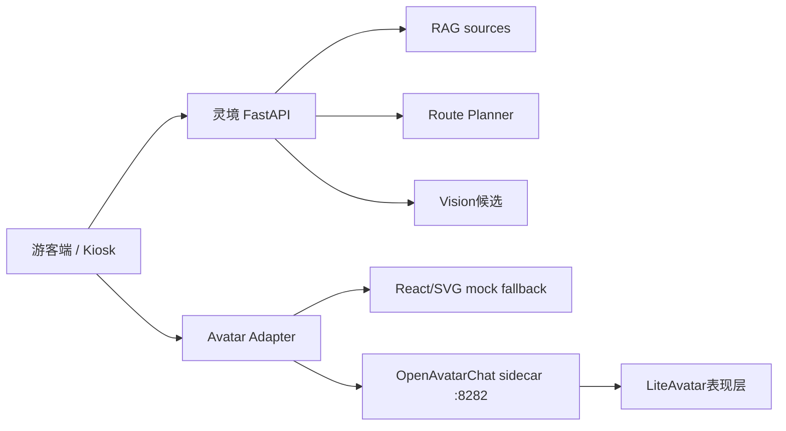

# OpenAvatarChat + LiteAvatar Sidecar 预研

## 结论

OpenAvatarChat + LiteAvatar 可以作为 `灵境导游` 的数字人表现层 sidecar 继续预研，但当前不建议直接替换主线 mock 数字人。

推荐路线是：

1. 保留当前 React/SVG/CSS mock 数字人作为默认和比赛兜底。
2. 将 OpenAvatarChat 单独部署在 sidecar 端口，例如 `127.0.0.1:8282`。
3. 游客端只在 feature flag 开启且 sidecar health 正常时嵌入 sidecar 画面。
4. 业务大脑仍由当前 FastAPI 负责：Query Understanding、RAG、Route Planner、Vision、Analytics。
5. OpenAvatarChat 不直接回答景区事实、不自由规划路线、不读取真实 API key 到前端。

这条路线能把风险压到表现层。如果 sidecar 失败，主线问答、识景、路线、Kiosk 和后台不受影响。

## 官方资料摘要

调研来源：

- OpenAvatarChat GitHub README: https://github.com/HumanAIGC-Engineering/OpenAvatarChat
- OpenAvatarChat 快速开始: https://humanaigc-engineering.github.io/OpenAvatarChat/getting-started/
- LiteAvatar 快速上手: https://humanaigc-engineering.github.io/OpenAvatarChat/getting-started/liteavatar.html
- OpenAvatarChat WebUI README: https://github.com/HumanAIGC-Engineering/OpenAvatarChat-WebUI
- LiteAvatar README: https://github.com/HumanAIGC/lite-avatar

关键事实：

- OpenAvatarChat 是模块化交互数字人对话实现，支持文本、语音、视频等交互，并可替换 ASR、LLM、TTS、Avatar 组件。
- 0.6.0 版本已拆出前后端，官方 WebUI 是 Vue 3 + TypeScript + Vite，后端默认将前端挂载到 `/ui`。
- 官方配置默认服务端口是 `8282`，启动命令形态为 `uv run src/demo.py --config <config>.yaml`。
- LiteAvatar 快速上手使用 `config/chat_with_openai_compatible_bailian_cosyvoice.yaml`，handler 组合包含 RTC、Silero VAD、SenseVoice、OpenAI-compatible LLM、百炼 CosyVoice TTS 和 LiteAvatar。
- LiteAvatar 快速上手提示需要 `DASHSCOPE_API_KEY`，或项目根目录 `.env`。
- OpenAvatarChat 快速开始要求 git-lfs、git submodule，并要求本机 NVIDIA 驱动支持 CUDA 版本 `>= 12.8`。
- LiteAvatar 独立仓库 README 描述它是实时 2D audio2face avatar，可在 CPU 设备上运行，并推荐 Python 3.10 与 CUDA 11.8；但 OpenAvatarChat 0.6.x 的整体运行要求以 OpenAvatarChat 文档为准。

## 本机 preflight

在 `D:\py\dota` 内执行的轻量检查结果：

| 项 | 结果 | 判断 |
| --- | --- | --- |
| Git | `git version 2.53.0.windows.2` | 可用 |
| git-lfs | `git-lfs/3.7.1` | 可用 |
| Docker | `Docker version 28.5.1` | 可用 |
| Docker Compose | `v2.40.2-desktop.1` | 可用 |
| GPU | `NVIDIA GeForce RTX 3060 Laptop GPU, 6144 MiB` | 可做轻量预研，显存不富裕 |
| NVIDIA driver | `591.44` | 可用 |
| CUDA compiler | `release 12.8, V12.8.61` | 满足 OpenAvatarChat CUDA 12.8 要求 |
| Python | `3.12.0` | 与 LiteAvatar 推荐 Python 3.10 不完全匹配 |
| Node / npm | `v24.14.0` / `11.13.0` | 当前前端可用 |
| uv | 未安装 | 需要补装 |
| GitHub clone | `git ls-remote` 直连超时或失败 | 不能依赖现场 GitHub 直连 |

## 当前项目接入点

当前数字人能力集中在：

- `frontend/src/components/DigitalHumanMock.tsx`
- `frontend/src/hooks/useDigitalHumanState.ts`
- `frontend/src/hooks/useSpeechSynthesis.ts`
- `frontend/src/pages/MobileHomePage.tsx`
- `frontend/src/pages/KioskPage.tsx`

当前主线已经具备：

- `welcome` / `listening` / `thinking` / `speaking` / `comforting` / `error` / `happy` 状态机。
- 浏览器 `SpeechSynthesis` TTS。
- 可选 `SpeechRecognition` 文本输入降级。
- QA、识景、路线、澄清、反馈都会驱动数字人状态。

因此 sidecar 只需要替换或增强展示层，不需要重写业务流程。

## 推荐架构



关键规则：

- 游客文本、识景、路线请求仍然先进 `灵境 FastAPI`。
- FastAPI 返回可信答案、路线、状态和讲解摘要。
- 前端把“要播报的短文本”和状态传给 Avatar Adapter。
- Avatar Adapter 决定使用 mock 数字人或 OpenAvatarChat sidecar。
- sidecar 不写入路线、不调用 RAG、不决定景点、不保存游客身份。

## 三种落地方案

### 方案 A：iframe 嵌入官方 WebUI

做法：

- 单独启动 OpenAvatarChat。
- 游客端配置 `VITE_AVATAR_SIDECAR_URL=http://127.0.0.1:8282/ui/index.html`。
- 数字人区域 iframe 嵌入 sidecar。
- sidecar 不可用时隐藏 iframe，显示当前 `DigitalHumanMock`。

优点：

- 最快看到画面。
- 对主仓库改动最小。

风险：

- 官方 WebUI 自带对话入口，容易绕过当前 RAG 和 Route Planner。
- WebRTC / 麦克风权限 / HTTPS 证书可能打断演示。
- 不能稳定把当前后端生成的回答注入 sidecar，除非继续做桥接。

判断：

- 适合作为“可启动可嵌入”验证。
- 不适合作为比赛主流程默认入口。

### 方案 B：自定义 OpenAvatarChat handler 桥接灵境后端

做法：

- 在 OpenAvatarChat 内写一个 LLM 或 chat handler。
- 该 handler 调用 `灵境 FastAPI` 的 QA / Route / Vision 结果。
- OpenAvatarChat 只负责 ASR、TTS、Avatar 输出。

优点：

- 架构最正确。
- 不绕过可信 RAG 和受约束 Route Planner。

风险：

- 需要维护外部项目 handler。
- 需要安装依赖、下载模型、处理 API key 和 WebRTC。
- 时间成本明显高于方案 A。

判断：

- 适合作为复赛或二阶段增强。
- 初赛前不建议压主线。

### 方案 C：LiteAvatar 离线片段或低风险演示位

做法：

- 用 LiteAvatar 独立推理生成 1 到 2 段固定讲解短视频。
- 游客端继续用当前 mock 数字人，演示时可展示“后续可替换为 LiteAvatar 表现层”。

优点：

- 不影响主流程。
- 可展示技术预研方向。

风险：

- 不是实时交互，不能替代数字人主体验。
- 如果素材不够好，反而显得像贴片视频。

判断：

- 可作为备用材料，不作为主方案。

## 推荐执行顺序

### Phase 1：只做 sidecar 文档和 preflight

本文件即 Phase 1 产物。

验收：

- 记录官方要求、本机条件和风险。
- 不下载大模型。
- 不修改主流程。
- 不引入真实 API key。

### Phase 2：最小可启动验证

#### 2026-05-15 执行记录

本次只做 sidecar 最小可启动验证，不接入主前端，不下载大模型，不使用真实 `DASHSCOPE_API_KEY`，不修改 RAG、Route Planner、Vision、Analytics 业务逻辑。

执行环境结果：

| 项 | 结果 | 判断 |
| --- | --- | --- |
| Git | `git version 2.53.0.windows.2` | 可用 |
| git-lfs | `git-lfs/3.7.1` | 可用 |
| Docker | `Docker version 28.5.1` | 可用 |
| Docker Compose | `Docker Compose version v2.40.2-desktop.1` | 可用 |
| GPU | `NVIDIA GeForce RTX 3060 Laptop GPU, 6144 MiB` | 可做轻量预研，显存不富裕 |
| NVIDIA driver / CUDA runtime | `591.44` / `CUDA Version: 13.1` from `nvidia-smi` | 驱动侧满足 OpenAvatarChat 文档的 CUDA `>= 12.8` 要求 |
| Python | `Python 3.12.0` | 与 LiteAvatar 推荐 Python 3.10 不完全匹配，后续建议单独 Python 3.10/3.11 环境 |
| Node / npm | `v24.14.0` / `11.13.0` | 当前主前端构建可用 |
| uv | 未安装，`uv` 命令不可识别 | 阻塞官方 `uv run ...` 安装/启动链路；未做全局安装 |

sidecar 工作区准备：

- 已创建 `external/`。
- 已新增 `external/.gitignore`，内容只允许提交该忽略文件本身，第三方源码、模型目录、`.env` 和构建产物默认不会进入主仓库。
- 已新增轻量检查脚本 `scripts/sidecar_preflight.ps1`，用于复跑环境检查；带 `-TryClone` 时只做一次 OpenAvatarChat clone 尝试，不安装依赖、不下载模型。

源码获取尝试：

```powershell
git clone --depth 1 https://github.com/HumanAIGC-Engineering/OpenAvatarChat.git external\OpenAvatarChat
```

结果：失败。

具体原因：

```text
fatal: unable to access 'https://github.com/HumanAIGC-Engineering/OpenAvatarChat.git/': Failed to connect to github.com port 443 after 21074 ms: Could not connect to server
```

当前可启动性判断：

| 验证项 | 当前结果 | 原因 |
| --- | --- | --- |
| 是否能获取 OpenAvatarChat 源码 | 否 | GitHub 直连 443 连接失败 |
| 是否能安装 OpenAvatarChat 依赖 | 未执行 | 源码未获取，且 `uv` 未安装 |
| 是否能启动 OpenAvatarChat | 否 | 缺源码、缺 `uv`，且未下载依赖/模型 |
| 是否能看到 WebUI | 否 | 服务未启动 |
| 是否能进入 LiteAvatar 模式 | 否 | 官方 LiteAvatar 快速链路需要源码、`uv`、依赖/模型，并通常需要 `DASHSCOPE_API_KEY` |
| 当前主项目 fallback | 保留 | 未修改主前端和业务逻辑，当前 React/SVG/CSS mock 数字人仍是默认兜底 |

下一步需要的授权或依赖：

1. 安装 `uv`。如果需要安装到用户或系统路径，需要用户明确授权；当前未做全局安装。
2. 解决 GitHub 源码获取问题，例如允许使用镜像、压缩包或手工下载到 `D:\py\dota\external\OpenAvatarChat`。
3. 如要真正进入 LiteAvatar 官方 demo，需要确认是否允许下载依赖和模型；当前未下载任何大模型。
4. 如要跑百炼 LLM/TTS 链路，需要用户明确提供 `DASHSCOPE_API_KEY`，且只能放在本机 `.env`，不得提交。

#### 2026-05-15 继续执行记录：路线 A

用户选择继续路线 A 后，本次继续推进到“源码已获取，依赖安装前置环境未满足”。

新增动作：

- 没有做全局 `uv` 安装。
- 在工作区内创建 `.sidecar-tools/` 虚拟环境，并通过 `pip --no-cache-dir` 安装本地 `uv`。
- 已将 `.sidecar-tools/` 加入根 `.gitignore`，避免本地工具环境被提交。
- 再次尝试 `git clone --depth 1` 获取 OpenAvatarChat，仍超时。
- 清理 clone 失败留下的半截 `.git` 目录。
- 改用 GitHub codeload zip 获取源码，成功下载 `external/OpenAvatarChat-main.zip` 并解压为 `external/OpenAvatarChat`。
- 未下载模型，`external/OpenAvatarChat/models` 只有官方空占位文件。
- 未安装 OpenAvatarChat 依赖。
- 未使用真实 `DASHSCOPE_API_KEY`。

当前新增环境结果：

| 项 | 结果 | 判断 |
| --- | --- | --- |
| 本地 uv | `.sidecar-tools\Scripts\uv.exe`，`uv 0.11.14` | 可用，且未全局安装 |
| OpenAvatarChat 源码 | 已通过 codeload zip 获取到 `external/OpenAvatarChat` | 可继续做依赖前检查 |
| OpenAvatarChat Git 仓库 | zip 解压，无 `.git` | 不影响预研，不能用于 submodule 更新 |
| OpenAvatarChat 模型 | 未下载，只有 `models/put_models_here.txt` | 符合“不下载大模型”边界 |
| Python 3.11 | uv 找到 `Python 3.11.6` | 不满足 `>=3.11.7, <3.12` |
| Python 3.12 | uv 找到 `Python 3.12.0` | 不满足 `>=3.11.7, <3.12` |

关键新 blocker：

```text
OpenAvatarChat pyproject.toml:
requires-python = ">=3.11.7, <3.12"
```

本机现有 Python 版本都不满足该范围：

- `Python 3.11.6` 低于下限。
- `Python 3.12.0` 高于上限。

因此当前仍不能进入：

```powershell
uv run install.py --config config/chat_with_openai_compatible_bailian_cosyvoice.yaml
```

否则 `uv` 会尝试解析或获取满足要求的 Python，并开始依赖安装。这一步可能下载解释器、PyTorch CUDA wheel、ASR/TTS/Avatar 相关依赖，已经超出“轻量预研”。

当前可启动性判断更新：

| 验证项 | 当前结果 | 原因 |
| --- | --- | --- |
| 是否能获取 OpenAvatarChat 源码 | 是 | codeload zip 成功，Git clone 仍失败 |
| 是否能安装 OpenAvatarChat 依赖 | 未执行 | Python 版本不满足，且未授权下载依赖 |
| 是否能启动 OpenAvatarChat | 否 | 依赖未安装、模型未下载、无 API key |
| 是否能看到 WebUI | 否 | 服务未启动 |
| 是否能进入 LiteAvatar 模式 | 否 | 需要 Python 3.11.7+、依赖、模型和通常的 `DASHSCOPE_API_KEY` |
| 当前主项目 fallback | 保留 | 未修改主前端和业务逻辑 |

继续 Phase 2 的下一步需要二选一：

1. 用户提供或授权安装 Python `3.11.7 <= version < 3.12`，建议 Python 3.11.9/3.11.10/3.11.11。
2. 明确授权 `uv` 自动获取受支持 Python，并接受它可能写入用户缓存目录。

在这之前，不建议继续安装 OpenAvatarChat 依赖，更不建议接入主前端。

#### 2026-05-15 继续执行记录：工作区内 managed Python

用户选择授权 `uv` 自动获取支持的 Python。为避免污染用户全局环境，本次没有使用默认用户缓存安装方式，而是把安装目录和缓存都固定在工作区内：

- Python 安装目录：`D:\py\dota\.sidecar-python`
- uv 缓存目录：`D:\py\dota\.sidecar-cache`
- 本地 uv：`D:\py\dota\.sidecar-tools\Scripts\uv.exe`

执行结果：

```powershell
.\.sidecar-tools\Scripts\uv.exe python install 3.11 `
  --install-dir .\.sidecar-python `
  --cache-dir .\.sidecar-cache `
  --no-registry
```

成功安装：

```text
Python 3.11.15
```

该版本满足 OpenAvatarChat 的 `requires-python = ">=3.11.7, <3.12"`。

注意事项：

- `uv` 仍短暂创建了用户目录 shim：`C:\Users\25433\.local\bin\python3.11.exe`。
- 已删除该 shim，后续只使用工作区内的 Python 绝对路径或 `UV_PYTHON_INSTALL_DIR`。
- 已将 `.sidecar-python/` 和 `.sidecar-cache/` 加入根 `.gitignore`。
- `scripts/sidecar_preflight.ps1` 已更新，会优先识别本地 uv 和工作区 managed Python。

当前验证：

```powershell
$env:UV_PYTHON_INSTALL_DIR='D:\py\dota\.sidecar-python'
D:\py\dota\.sidecar-tools\Scripts\uv.exe python find 3.11 --managed-python
```

返回：

```text
D:\py\dota\.sidecar-python\cpython-3.11-windows-x86_64-none\python.exe
```

仍未执行：

- 未运行 `uv run install.py --config ...`
- 未安装 OpenAvatarChat 依赖
- 未下载模型
- 未配置或使用 `DASHSCOPE_API_KEY`
- 未启动 OpenAvatarChat
- 未接入主前端

下一步如果继续，需要明确授权安装依赖。该步骤预计会下载 PyTorch CUDA 12.8、onnxruntime-gpu、ASR/TTS/Avatar handler 依赖和构建工具，体积和耗时都明显高于当前 preflight。

建议新建不提交的大体积目录或明确 gitignore：

- `external/OpenAvatarChat/`
- `external/OpenAvatarChat-WebUI/`
- `external/.gitignore`

如果要提交，只提交：

- `docs/OPENAVATARCHAT_LITEAVATAR_SIDECAR_RESEARCH.md`
- 轻量启动说明或脚本
- `.env.example` 中的空 sidecar 占位

不提交：

- 第三方源码
- 模型权重
- `.env`
- API key
- 构建产物

建议命令，需在确认网络和磁盘空间后再执行：

```powershell
cd D:\py\dota
git lfs install
python -m pip install uv
git clone --depth 1 https://github.com/HumanAIGC-Engineering/OpenAvatarChat.git external\OpenAvatarChat
cd external\OpenAvatarChat
git submodule update --init --recursive --depth 1
uv run install.py --config config/chat_with_openai_compatible_bailian_cosyvoice.yaml
uv run scripts/download_models.py --handler liteavatar --source modelscope
uv run src/demo.py --config config/chat_with_openai_compatible_bailian_cosyvoice.yaml
```

注意：

- 以上命令可能下载大量依赖和模型，不适合在没有时间余量时执行。
- 需要 `DASHSCOPE_API_KEY` 才能走官方 LiteAvatar 快速链路中的百炼 LLM/TTS。
- 如果 GitHub 直连继续失败，应改用压缩包、镜像或手工下载，而不是卡在 clone 上。

#### 2026-05-15 继续执行记录：OpenAvatarChat 依赖安装

用户确认继续后，本轮只推进 sidecar 依赖安装与 import smoke，不下载模型，不配置或使用真实 `DASHSCOPE_API_KEY`，不启动 OpenAvatarChat 服务，不接入主前端。

执行命令：

```powershell
cd D:\py\dota\external\OpenAvatarChat
$env:UV_PYTHON_INSTALL_DIR='D:\py\dota\.sidecar-python'
$env:UV_CACHE_DIR='D:\py\dota\.sidecar-cache'
$env:PATH='D:\py\dota\.sidecar-tools\Scripts;' + $env:PATH
D:\py\dota\.sidecar-tools\Scripts\uv.exe run --python 3.11 install.py --config config/chat_with_openai_compatible_bailian_cosyvoice.yaml
```

第一次执行曾失败一次，原因是 `install.py` 内部调用裸 `uv pip install ...`，而工作区本地 uv 不在当前 `PATH`。处理方式是只在当前命令进程临时追加：

```powershell
$env:PATH='D:\py\dota\.sidecar-tools\Scripts;' + $env:PATH
```

随后重跑成功，官方配置 `config/chat_with_openai_compatible_bailian_cosyvoice.yaml` 识别到 7 个 handler：

- `CosyVoice`
- `InterruptHandler`
- `LLMOpenAICompatible`
- `LiteAvatar`
- `RtcClient`
- `SenseVoice`
- `SileroVad`

关键依赖安装与 smoke 结果：

| 项 | 结果 |
| --- | --- |
| `torch` | `2.8.0+cu128` |
| `torch.cuda.is_available()` | `True` |
| `onnxruntime` | `1.20.2` |
| `dashscope` | import ok |
| `transformers` | `4.44.2` |
| `funasr` | `1.2.9` |
| `vocos` | import ok |

当前进展判断：

| 验证项 | 当前结果 | 说明 |
| --- | --- | --- |
| OpenAvatarChat 源码 | 已获取 | 通过 codeload zip 解压到 `external/OpenAvatarChat`，该目录不提交 |
| 支持的 Python | 已具备 | 工作区内 managed Python `3.11.15` |
| OpenAvatarChat 依赖 | 已安装 | `.venv` 位于 ignored 第三方目录内 |
| CUDA 依赖 smoke | 通过 | PyTorch CUDA wheel 可识别本机 GPU |
| 模型权重 | 未下载 | 仍未运行 `scripts/download_models.py` |
| 百炼 API Key | 未配置 | 未使用真实 `DASHSCOPE_API_KEY` |
| OpenAvatarChat 服务 | 未启动 | 还未进入 WebUI 或 LiteAvatar demo |
| 主项目接入 | 未做 | 没有修改 RAG、Route Planner、Vision、Analytics 或主前端 |

更新后的 `scripts/sidecar_preflight.ps1` 增加了 OpenAvatarChat dependency smoke，会复查本地 uv、managed Python 与上述关键依赖 import。它仍然只是预检脚本，不会下载模型或启动服务。

下一步如果继续推进，需要单独确认是否允许下载 LiteAvatar / SenseVoice / CosyVoice 等模型文件，并准备仅存放在本机 `.env` 的 `DASHSCOPE_API_KEY`。在这之前，主项目演示仍应保留当前 React/SVG/CSS mock 数字人作为兜底表现层。

#### 2026-05-15 继续执行记录：LiteAvatar 可启动验证

用户提供测试限额的 DashScope Key 后，本轮尝试进入官方 LiteAvatar sidecar 可启动验证。Key 只用于本机启动进程环境，未写入 tracked 文件，日志中出现的 Key 已在本地日志文件中脱敏。

本轮新增的 ignored 本地资源：

- `external/OpenAvatarChat/src/handlers/avatar/liteavatar/algo/liteavatar/weights/`
- `external/OpenAvatarChat/src/handlers/avatar/liteavatar/algo/liteavatar/` 中补齐的 `lite-avatar` submodule 源码
- `external/OpenAvatarChat/resource/avatar/liteavatar/20250408/sample_data`
- `external/OpenAvatarChat/.runtime-dll/`
- `external/lite-avatar-main.zip`
- `external/lite-avatar-main-tmp/`

执行结果：

| 项 | 结果 | 说明 |
| --- | --- | --- |
| LiteAvatar 权重下载 | 成功 | 通过 ModelScope 下载 `lm.pb`、`model_1.onnx`、`model.pb` |
| LiteAvatar 算法源码 | 成功 | 因主源码来自 zip、无 `.git`，无法 `git submodule update`，改用 codeload zip 补齐 `HumanAIGC/lite-avatar` |
| Opus 运行库 | 已绕过 | `opuslib` 找不到系统 Opus DLL；从 `av.libs` 复制 DLL 到 ignored `.runtime-dll` 并加入启动进程 PATH |
| RtcClient handler | 已注册 | H.264 硬件编码不可用，自动降级 CPU `libx264` |
| SenseVoice handler | 已注册 | 尚未做真实语音输入验证 |
| CosyVoice handler | 已注册 | 仅验证 handler 初始化，未做真实 TTS 调用 |
| LLMOpenAICompatible handler | 已注册 | 仅验证 handler 初始化，未做真实对话调用 |
| LiteAvatar handler | 已注册并进入初始化 | `liteAvatar init over`，样例 avatar 数据已下载并解压 |
| 端口 `127.0.0.1:8282` | 未成功监听 | demo 未进入可访问 WebUI 状态 |

当前阻塞：

```text
PermissionError: [WinError 5] 拒绝访问。
```

该错误出现在 LiteAvatar worker 的 Windows multiprocessing spawn 阶段，父子进程通过 pipe handle 传递时触发权限问题。现象是主 demo 进程没有持续运行到 uvicorn 监听阶段，残留的子进程会继续加载 LiteAvatar，一段时间后需要手动清理。

本轮安全边界：

- 未修改主项目 RAG、Route Planner、Vision、Analytics。
- 未修改主前端数字人组件。
- 未把 OpenAvatarChat 接入游客端或 Kiosk。
- 未把 Key 写入 tracked 文件。
- 未声称 sidecar 已可用于比赛演示。

下一步建议：

1. 优先把这次结果视为 sidecar spike 的阶段性结论：依赖、权重、算法源码、GPU import、handler 注册基本打通，但 Windows multiprocessing 启动仍不稳定。
2. 若继续深挖，可只在 ignored 的 `external/OpenAvatarChat` 内做一个本地 probe：降低 LiteAvatar 并发/子进程数量，或尝试 CPU/fast mode，确认是否能绕过 WinError 5。
3. 比赛主线不要等待 sidecar，继续保留当前 mock 2D 数字人作为可靠兜底。
4. 在 sidecar 能稳定监听 `8282` 前，不做前端 feature flag iframe 接入。

#### 2026-05-15 继续执行记录：LiteAvatar sidecar 启动成功

继续排查后，确认上一轮 `PermissionError: [WinError 5]` 不是根因，而是父进程提前退出后，LiteAvatar 子进程继续执行 Windows multiprocessing spawn 时产生的连带错误。

根因链路：

1. OpenAvatarChat 主源码来自 codeload zip，不包含 git submodule。
2. `HumanAIGC/lite-avatar` submodule 缺失时，LiteAvatar 算法源码缺 `lite_avatar.py`。
3. 补齐 LiteAvatar 后，启动继续推进到 `SileroVad`。
4. `snakers4/silero-vad` submodule 缺失，导致 `silero_vad.onnx` 不存在。
5. 主进程加载 `SileroVad` 失败并提前退出，LiteAvatar 子进程随后报 Windows pipe handle 权限错误。

已在 ignored 第三方目录内补齐：

- `external/OpenAvatarChat/src/handlers/avatar/liteavatar/algo/liteavatar/`
- `external/OpenAvatarChat/src/handlers/vad/silerovad/silero_vad/`

为适配本机 Windows 启动，还做了 3 个本地 probe 调整：

- `config/local_sidecar_probe.yaml`：`concurrent_limit: 1`，降低 LiteAvatar worker 数量，避免 6GB 显存和 Windows 多进程启动压力。
- `config/local_sidecar_probe.yaml`：`log_level: "WARNING"`，减少 handler config 输出。
- `src/service/service_utils/logger_utils.py`：本地 ignored 补丁，让文件日志也遵守配置的 log level，避免 API key 被写入 `logs/log.log`。

启动环境：

```powershell
$env:UV_PYTHON_INSTALL_DIR='D:\py\dota\.sidecar-python'
$env:UV_CACHE_DIR='D:\py\dota\.sidecar-cache'
$env:PYTHONUTF8='1'
$env:PYTHONIOENCODING='utf-8'
$env:PATH='D:\py\dota\external\OpenAvatarChat\.runtime-dll;D:\py\dota\.sidecar-tools\Scripts;' + $env:PATH
$env:DASHSCOPE_API_KEY='<local test key>'
```

启动命令：

```powershell
cd D:\py\dota\external\OpenAvatarChat
D:\py\dota\.sidecar-tools\Scripts\uv.exe run --python 3.11 src/demo.py --host 127.0.0.1 --port 8282 --config config/local_sidecar_probe.yaml
```

验证结果：

| 验证项 | 结果 |
| --- | --- |
| `127.0.0.1:8282` 监听 | 成功 |
| `/liveness` | `200 {"status":"ok"}` |
| `/readiness` | `200 {"status":"ok"}` |
| `/version` | `200 {"version":"0.6.0"}` |
| `/gradio/` | `200`，返回 Gradio HTML |
| LiteAvatar 子进程 | 出现 `Avatar process is ready` |
| 明文 Key 日志扫描 | 当前 `logs/*.log` 与 `external/OpenAvatarChat/logs/*.log` 未发现测试 Key 明文 |

当前限制：

- 服务是 HTTP，本地证书缺失；日志提示 `localhost.crt` / `localhost.key` 不存在。
- 尚未做麦克风、WebRTC 权限、真实语音输入、真实 TTS 播放和浏览器端视频流互动验证。
- 该 sidecar 仍不能接管 `灵境导游` 的 RAG、路线规划、识景、运营分析；只允许作为表现层预研。

阶段性结论：

OpenAvatarChat + LiteAvatar 在本机已经从“依赖可导入”推进到“sidecar 服务可启动、健康检查可访问、LiteAvatar worker ready”。但它还不是比赛主流程的一部分，距离可演示集成还差 WebUI/浏览器交互验证和稳定性评估。

#### 2026-05-15 继续执行记录：改用 OpenAvatarChat-WebUI

启动成功后访问 Gradio 页面时，页面提示：

```text
The Gradio page is no longer available. Please use the openavatarchat-webui submodule instead.
```

继续按官方前后端分离路线补齐 WebUI submodule。由于当前 OpenAvatarChat 主源码仍是 codeload zip 解压而来，没有 `.git`，不能执行 `git submodule update`，因此使用 codeload zip 补齐到 ignored 的 submodule 目录：

```text
external/OpenAvatarChat/src/service/frontend_service/frontend
```

该 WebUI zip 自带 `dist/`，本轮没有额外执行 `pnpm install` 或 `pnpm run build`。

重新启动 sidecar 后，验证结果：

| 验证项 | 结果 |
| --- | --- |
| `127.0.0.1:8282` 监听 | 成功 |
| `/liveness` | `200` |
| `/readiness` | `200` |
| `/` | `307`，重定向到 `/ui/index.html` |
| `/ui/index.html` | `200`，返回 OpenAvatarChat-WebUI HTML |
| `/openavatarchat/initconfig` | `200` |
| LiteAvatar worker | 出现 `Avatar process is ready` |
| 明文 Key 日志扫描 | 当前 `logs/*.log` 与 `external/OpenAvatarChat/logs/*.log` 未发现测试 Key 明文 |

当前 WebUI 初始化配置响应：

```json
{
  "avatar_config": {},
  "rtc_configuration": null,
  "track_constraints": {
    "audio": {
      "sampleRate": 16000,
      "channelCount": 1,
      "autoGainControl": false,
      "noiseSuppression": false,
      "echoCancellation": true
    }
  }
}
```

当前可访问入口：

```text
http://127.0.0.1:8282/ui/index.html
```

剩余验证项：

- 需要在浏览器中确认 WebUI 首屏、静态资源、控制台错误。
- 需要手工授权麦克风后验证 WebRTC 连接、语音输入、LLM、CosyVoice TTS 和 LiteAvatar 视频流。
- 因为当前是 HTTP，本地浏览器访问必须使用 `127.0.0.1` 或 `localhost`，非本机访问仍需要证书。
- WebUI/sidecar 仍只作为表现层预研，不接管 `灵境导游` 主业务。

### Phase 3：灵境前端 feature flag 嵌入

只在 sidecar 稳定后做。

建议接口：

```env
VITE_AVATAR_SIDECAR_ENABLED=false
VITE_AVATAR_SIDECAR_URL=
```

建议组件：

- 新增 `frontend/src/components/AvatarSidecarFrame.tsx`
- 新增 `frontend/src/components/AvatarStage.tsx`
- `AvatarStage` 内部根据配置和 health 状态选择：
  - sidecar iframe
  - 当前 `DigitalHumanMock`

兜底策略：

- sidecar 3 秒内不可达，显示 mock 数字人。
- iframe 加载失败，显示 mock 数字人。
- 浏览器权限被拒，显示 mock 数字人。
- sidecar 内对话入口不用于主业务，只作为表现层预览。

## 风险清单

| 风险 | 影响 | 处理 |
| --- | --- | --- |
| GitHub clone 失败 | 无法拉源码 | 使用镜像/压缩包，或只做文档预研 |
| uv 未安装 | 无法按官方命令启动 | 安装 `uv`，或用独立环境 |
| Python 版本不匹配 | 依赖安装失败 | 为 sidecar 单独创建 Python 3.10/3.11 环境 |
| DashScope API key 缺失 | 官方 LiteAvatar 快速链路不可用 | 不作为默认演示，保留 mock |
| 6GB 显存不足 | 高负载 avatar 卡顿 | 只验证 LiteAvatar，不碰更重 avatar |
| WebRTC/HTTPS 权限 | iframe 或麦克风失败 | iframe 只做可选表现层，主流程文本可用 |
| sidecar 自带 LLM 绕过业务 | 可信边界被破坏 | 禁止把 sidecar 聊天作为景区事实入口 |
| 第三方源码/模型入库 | 仓库膨胀和授权风险 | external 目录 gitignore，只提交轻量文档 |

## 当前建议

短期建议：不要把 OpenAvatarChat + LiteAvatar 接入当前主演示路径。

更好的下一步是做一个最小 sidecar spike：

1. 安装 `uv`。
2. 尝试获取 OpenAvatarChat 源码，优先解决 GitHub 直连失败。
3. 不配置真实 API key 时，只验证依赖安装和服务入口是否能起来。
4. 有 API key 时，再验证 LiteAvatar demo 是否能显示 2D 数字人画面。
5. 成功后再做前端 feature flag iframe 嵌入。

比赛主线仍应使用当前 mock 数字人兜底。它已经能跟 RAG、识景、路线、反馈状态机稳定联动，这比一个不稳定的真实 sidecar 更重要。
